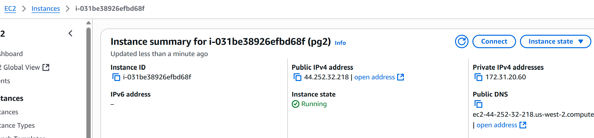

# Assignment - Serverless Architecture & Cloud Automation

This repository contains AWS Lambda functions for automating various cloud operations using Boto3 and Python. Each task demonstrates different aspects of cloud automation and serverless architecture.

## Technical Stack

- **Runtime**: Python 3.x
- **AWS SDK**: Boto3
- **Services Used**: 
  - AWS Lambda
  - Amazon EC2
  - Amazon S3
  - AWS IAM
  - Amazon CloudWatch Events
- **Architecture**: Serverless, Event-driven

## Security Considerations

- IAM roles with least privilege principle
- Proper error handling and logging
- Resource-specific permissions
- Secure credential management through AWS IAM

## Monitoring and Logging

All Lambda functions include comprehensive logging through CloudWatch Logs for:
- Function execution status
- Resource operations performed
- Error tracking and debugging
- Performance monitoring

---

## Task 1 - Automated EC2 Instance Management

**Objective**: Automate the stopping and starting of EC2 instances based on their tags using AWS Lambda.

### Implementation Steps:

1. **EC2 Setup**:
   - Created two t2.micro instances
   - Tagged first instance with `Action: Auto-Stop`
   - Tagged second instance with `Action: Auto-Start`

2. **IAM Role Configuration**:
   - Used pre-existing Lambda execution role with `AmazonEC2FullAccess` policy
   - Configured proper permissions for EC2 operations

3. **Lambda Function Development**:
   - Implemented Python function using Boto3 EC2 client
   - Added logic to describe instances and check tags
   - Automated start/stop operations based on tag values
   - Included error handling and logging

4. **Function Execution**:
   - Manual invocation of Lambda function
   - Verified instance state changes in EC2 dashboard

### Key Features:
- Tag-based instance management
- Automated start/stop operations
- Comprehensive logging for monitoring
- Error handling for robust execution

### Code Location:
- **Lambda Function**: [`task_1_manage_ec2_instances/lambda.py`](task_1_manage_ec2_instances/lambda.py)

### Screenshots:
- 
- 
- 
- 
- 
- 
- 
- 

---

## Task 2 - Automated S3 Bucket Cleanup

**Objective**: Automatically delete files older than 30 days from an S3 bucket using AWS Lambda.

### Implementation Steps:

1. **S3 Bucket Setup**:
   - Created S3 bucket named `pranshu-b11`
   - Uploaded multiple files with varying ages
   - Ensured some files were older than 30 days for testing

2. **IAM Role Configuration**:
   - Used pre-existing Lambda execution role with `AmazonS3FullAccess` policy
   - Configured appropriate S3 permissions

3. **Lambda Function Development**:
   - Implemented Python function using Boto3 S3 client
   - Added logic to list bucket objects and check modification dates
   - Calculated file age using datetime operations
   - Automated deletion of files older than 30 days
   - Included comprehensive logging

4. **Function Testing**:
   - Manual invocation and monitoring
   - Verified file deletion in S3 console

### Key Features:
- Age-based file cleanup (30+ days)
- Timezone-aware date calculations
- Detailed logging of deleted objects
- Error handling and exception management

### Code Location:
- **Lambda Function**: [`task_2_auto_cleanup_s3_bucket/lamdba.py`](task_2_auto_cleanup_s3_bucket/lamdba.py)

### Screenshots:
- 
- 
- 
- 
- 

---

## Task 3 - Monitor Unencrypted S3 Buckets

**Objective**: Detect and report S3 buckets without server-side encryption enabled using AWS Lambda.

### Implementation Steps:

1. **S3 Bucket Setup**:
   - Created multiple S3 buckets
   - Configured some buckets without server-side encryption
   - Ensured variety in encryption settings for testing

2. **IAM Role Configuration**:
   - Used pre-existing Lambda execution role with `AmazonS3ReadOnlyAccess` policy
   - Limited permissions for security best practices

3. **Lambda Function Development**:
   - Implemented Python function using Boto3 S3 client
   - Added logic to list all S3 buckets in specific region
   - Implemented encryption status checking
   - Added detection logic for unencrypted buckets
   - Included comprehensive logging and error handling

4. **Security Monitoring**:
   - Manual invocation for security auditing
   - Log analysis to identify unencrypted buckets

### Key Features:
- Comprehensive bucket encryption auditing
- Region-specific bucket scanning
- Detailed security reporting
- Exception handling for access issues

### Code Location:
- **Lambda Function**: [`task_3_monitor_unencrypted_buckets/lambda.py`](task_3_monitor_unencrypted_buckets/lambda.py)

### Screenshots:
- 
- 
- 

---

## Task 5 - Auto-Tagging EC2 Instances on Launch

**Objective**: Automatically tag newly launched EC2 instances with current date and custom tags using event-driven Lambda function.

### Implementation Steps:

1. **Event-Driven Architecture Setup**:
   - Configured CloudWatch Events Rule for EC2 instance launch events
   - Set up Lambda function as event target

2. **IAM Role Configuration**:
   - Used pre-existing Lambda execution role with `AmazonEC2FullAccess` policy
   - Configured permissions for EC2 tagging operations

3. **Lambda Function Development**:
   - Implemented Python function using Boto3 EC2 client
   - Added event parsing to extract instance ID
   - Implemented automatic tagging with:
     - `Auto-Tag-Org: Hero-vired`
     - `Auto-Tag-Date: Current date (YYYY-MM-DD)`
   - Included comprehensive logging and error handling

4. **Event Integration**:
   - CloudWatch Events trigger configuration
   - Real-time instance tagging upon launch

5. **Testing and Validation**:
   - Launched new EC2 instance
   - Verified automatic tag application
   - Monitored CloudWatch logs

### Key Features:
- Event-driven automation
- Real-time instance tagging
- Date-based tracking
- Organization-specific tagging
- Comprehensive logging

### Code Location:
- **Lambda Function**: [`task_5_auto_tag_ec2_instances/lambda.py`](task_5_auto_tag_ec2_instances/lambda.py)

### Screenshots:
- 
- 
- 
- 

---